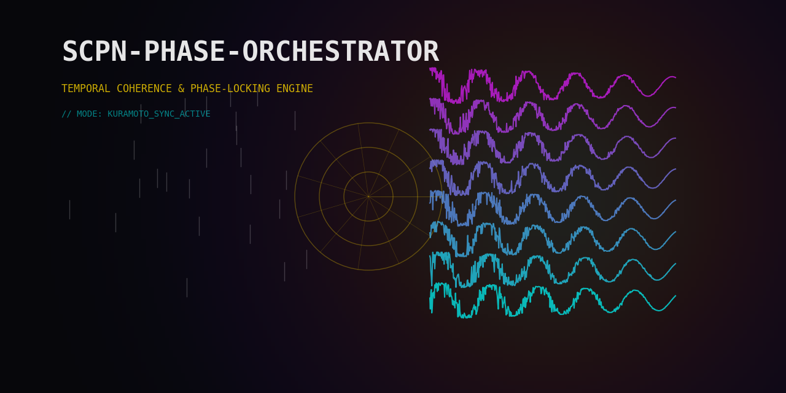

# SCPN Phase Orchestrator

Domain-agnostic coherence control compiler built on Kuramoto/UPDE phase dynamics.

[](https://github.com/anulum/scpn-phase-orchestrator/actions/workflows/ci.yml)
[](https://pypi.org/project/scpn-phase-orchestrator/)
[](https://anulum.github.io/scpn-phase-orchestrator/)
[](https://www.gnu.org/licenses/agpl-3.0)
[](https://www.python.org/downloads/)



## What It Does

Treats Kuramoto phase dynamics as a universal synchrony state-space.
Any hierarchical coupled-cycle system — plasma, cloud infrastructure,
traffic, power grids, factories, biology — maps onto the same engine.

## Core Pipeline

```
Domain Binder → Oscillator Extractors (P/I/S) → UPDE Engine → Supervisor → Actuation Mapper
```

### 3-Channel Oscillator Model

| Channel | Source | Phase Extraction |
|---------|--------|-----------------|
| **Physical (P)** | Continuous waveforms | Hilbert transform, zero-crossing |
| **Informational (I)** | Event/decision streams | Event-phase from message timing |
| **Symbolic (S)** | Discrete state sequences | Ring-phase θ=2πs/N, graph-walk |

### 4 Universal Control Knobs

| Knob | Meaning |
|------|---------|
| **K** | Coupling strength (Knm matrix) |
| **α** | Phase lag (transport/actuator delays) |
| **ζ** | Driver strength (external forcing) |
| **Ψ** | Reference phase (control target) |

### Dual Objective

- **R_good**: Coherence to maintain (actuator ↔ target phase-lock)
- **R_bad**: Coherence to suppress (harmful mode-locking)

## Quickstart

```bash
pip install -e ".[dev]"

# Scaffold a new domainpack
spo scaffold my_domain

# Validate a domain binding spec
spo validate domainpacks/minimal_domain/binding_spec.yaml

# Run a domain simulation
spo run domainpacks/queuewaves/binding_spec.yaml --steps 1000

# Replay from audit log
spo replay audit.jsonl --output report.json
```

## Platform Support

| Platform | Python engine | Rust FFI (optional) |
|----------|--------------|---------------------|
| Linux | Full | Full |
| macOS | Full | Full |
| Windows | Full | Experimental (requires MSVC toolchain) |

The PyPI package is pure Python. Rust FFI provides optional acceleration
and is built from source via `maturin develop`.

## Domainpacks

| Pack | Domain | Purpose |
|------|--------|---------|
| `autonomous_vehicles` | Vehicles | Platoon phase-locking, leader-follower sync (3 layers, 8 oscillators) |
| `bio_stub` | Biology | Multi-scale biological oscillators (4 layers, 16 oscillators) |
| `cardiac_rhythm` | Cardiology | Gap-junction coupling, arrhythmia (4 layers, 10 oscillators) |
| `chemical_reactor` | Process control | Hopf bifurcation, Semenov limit (4 layers, 10 oscillators) |
| `circadian_biology` | Chronobiology | SCN clock-gene coupled oscillators (4 layers, 10 oscillators) |
| `epidemic_sir` | Epidemiology | Epidemic wave synchronisation (3 layers, 8 oscillators) |
| `firefly_swarm` | Ecology | Flash synchronisation, Mirollo-Strogatz (2 layers, 8 oscillators) |
| `fusion_equilibrium` | Fusion equilibrium | Grad-Shafranov + FusionCoreBridge (6 layers, 12 oscillators) |
| `geometry_walk` | Graph systems | Random-walk phase coupling (2 layers, 8 oscillators) |
| `laser_array` | Photonics | Semiconductor laser phase-locking (3 layers, 8 oscillators) |
| `manufacturing_spc` | Manufacturing | Statistical process control (3 layers, 9 oscillators) |
| `metaphysics_demo` | P/I/S showcase | Imprint + geometry ablation (3 layers, 7 oscillators) |
| `minimal_domain` | Synthetic | Minimal-but-complete pipeline example (2 layers, 4 oscillators) |
| `network_security` | Cybersecurity | Traffic anomaly detection, DDoS suppression (3 layers, 8 oscillators) |
| `neuroscience_eeg` | Neuroscience | EEG band->phase, seizure detection (6 layers, 14 oscillators) |
| `plasma_control` | Tokamak plasma | MHD/transport multi-scale control (8 layers, 16 oscillators) |
| `pll_clock` | Telecommunications | PLL network clock synchronisation (3 layers, 8 oscillators) |
| `power_grid` | Power systems | Swing equation = Kuramoto (5 layers, 12 oscillators) |
| `quantum_simulation` | Quantum computing | Qubit register phase coupling (3 layers, 8 oscillators) |
| `queuewaves` | Cloud/queues | Retry storm desynchronisation (3 layers, 6 oscillators) |
| `rotating_machinery` | Vibration | Harmonics, ISO 10816 boundaries (4 layers, 10 oscillators) |
| `satellite_constellation` | Aerospace | Orbital slot synchronisation, beam handover (3 layers, 8 oscillators) |
| `swarm_robotics` | Robotics | Vicsek collective motion (3 layers, 8 oscillators) |
| `traffic_flow` | Transportation | Signal coordination = phase sync (4 layers, 10 oscillators) |

### Adding a Domain

1. Create `domainpacks/<name>/binding_spec.yaml` declaring layers,
   oscillator families, coupling, drivers, objectives, and boundaries.
2. Optionally add `policy.yaml` for declarative supervisor rules.
3. Validate: `spo validate domainpacks/<name>/binding_spec.yaml`
4. Run: `spo run domainpacks/<name>/binding_spec.yaml --steps 1000`

See [`metaphysics_demo`](domainpacks/metaphysics_demo/) for a full
example exercising all three channels, imprint modulation, geometry
projection, and policy-driven control.  Spec format reference:
[binding_spec.schema.json](docs/specs/binding_spec.schema.json).

## Development

```bash
pip install -e ".[dev]"
ruff check src/ tests/
ruff format --check src/ tests/
pytest tests/ -v --tb=short
mkdocs build
```

## License

AGPL-3.0-or-later. Commercial licensing available — contact protoscience@anulum.li.

## Citation

See [CITATION.cff](CITATION.cff).

---

© 1998–2026 Miroslav Šotek. All rights reserved.
Contact: www.anulum.li | protoscience@anulum.li
