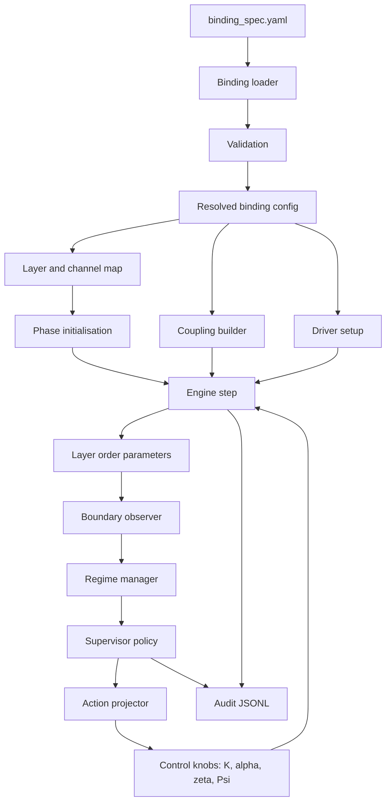

# Pipeline Execution

This page shows how a binding file becomes a controlled simulation run.
It is the shortest path from YAML fields to runtime behaviour.

## One-Page Flow



## What `spo validate` Resolves

`spo validate <binding_spec>` does more than say that YAML is syntactically
valid. It now prints the resolved runtime summary:

```text
Valid
Resolved configuration:
  domain: minimal_domain v0.1.0 (research)
  timing: sample=0.01s control=0.1s interval=10 steps
  structure: layers=3 oscillators=6 channels=I, P, S
  engine: kuramoto features=none
  channel P: families=physical extractors=hilbert driver_keys=none layers=1 oscillators=2
```

Use this block to check that the binding spec means what you think it means
before running a simulation.

## YAML To Runtime Mapping

| YAML field | Runtime object | Used for |
|------------|----------------|----------|
| `name`, `version`, `safety_tier` | binding metadata | audit headers, operator context |
| `sample_period_s` | engine `dt` | integration timestep |
| `control_period_s` | control interval | supervisor cadence in steps |
| `layers` | layer ranges | per-layer `R`, objectives, scoped actions |
| `oscillator_families` | channel and extractor map | P/I/S or named-channel routing |
| `coupling` | `CouplingState` | `K_nm`, lag `alpha`, active template |
| `drivers` | drive initialisation | `zeta`, `Psi`, physical/event/symbolic drive |
| `objectives` | good/bad partitions | final `R_good`, `R_bad`, policy metrics |
| `boundaries` | `BoundaryObserver` | soft/hard violation events |
| `actuators` | `ActionProjector` bounds | clipping and rate-limited actuation |
| `imprint_model` | `ImprintModel` | slow memory modulation of coupling |
| `geometry_prior` | coupling projection | symmetry or non-negative constraints |
| `protocol_net` | Petri-net adapter | regime sequencing FSM |
| `amplitude` | `StuartLandauEngine` | phase plus amplitude dynamics |

## Execution Steps

1. Load and validate the binding file.
2. Build the resolved binding summary from the validated `BindingSpec`.
3. Count oscillators from `layers`.
4. Build `K_nm` and `alpha` from `coupling`.
5. Select `UPDEEngine` or `StuartLandauEngine` from `amplitude`.
6. Build optional protocol, imprint, geometry, and policy-rule components.
7. Initialise phases and natural frequencies.
8. Resolve driver state from `drivers`.
9. Every integration step:
   - apply driver and control inputs,
   - project coupling if a geometry prior is enabled,
   - advance the engine,
   - compute layer order parameters,
   - evaluate boundaries,
   - update the regime and policy,
   - project actions through rate and value limits,
   - write audit state if audit logging is enabled.
10. Print final `R_good`, `R_bad`, and regime.

## Audit Header

When `spo run --audit run.jsonl` is used, the first audit record includes
the same resolved binding summary. It records structural runtime choices and
driver key names, not raw driver values. That keeps replay/debug metadata useful
without copying endpoint strings or deployment-local values into audit logs.

The header is intended for:

- replay context,
- support triage,
- domainpack review,
- explaining why a run used a given engine, channel map, or control cadence.

## Common Misreads Caught By The Summary

| Symptom | What to inspect |
|---------|-----------------|
| Wrong control cadence | `timing: ... interval=N steps` |
| Missing named channel | `structure: ... channels=...` |
| Driver ignored | `channel X: ... driver_keys=...` |
| Unbound layers | `note: N layer(s) have no explicit oscillator family binding` |
| Wrong engine | `engine: kuramoto` vs `engine: stuart_landau` |
| Optional model not active | `features=...` |

For a first run, use:

```bash
spo validate domainpacks/minimal_domain/binding_spec.yaml
spo run domainpacks/minimal_domain/binding_spec.yaml --steps 100 --audit run.jsonl
spo report run.jsonl
```
