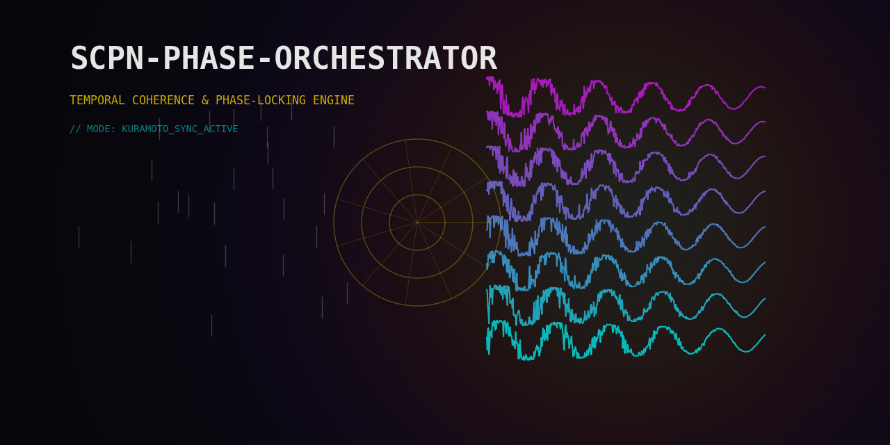

# System Overview



## Core Thesis

Systems with meaningful cyclic observables and defensible coupling assumptions
can sometimes be modelled with Kuramoto-family phase dynamics. The orchestrator
provides a shared workflow: extract phases, integrate a declared coupling model,
measure coherence, and produce bounded control proposals. Reusing the equations
across domains does not make their semantics or evidence interchangeable; each
binding still needs domain-specific calibration and validation.

The binding spec carries the reusable model contract—signals, topology,
coupling, and objectives—while domain-specific data preparation, calibration,
acceptance thresholds, and deployment evidence remain outside that abstraction.

## Pipeline

For a step-by-step map from YAML to extractors, engines, supervisor,
actuation, audit, and replay, see
[How the Pipeline Fires](pipeline_firing.md).

```
Domain Signals
    |
    v
Domain Binder -----> BindingSpec (YAML)
    |                   declares oscillators, layers, coupling, objectives
    v
Oscillator Extractors
    |  P: Hilbert phase from continuous waveform
    |  I: inter-event frequency from timestamps
    |  S: ring-phase from discrete state sequence
    v
UPDEEngine
    |  dtheta_i/dt = omega_i
    |              + sum_j K_ij sin(theta_j - theta_i - alpha_ij)
    |              + zeta sin(Psi - theta_i)
    |
    |  Methods: Euler (default), RK4, RK45 (adaptive Dormand-Prince)
    |  Output: phases, R per layer, cross-layer alignment
    v
ImprintModel (optional)
    |  m_k(t+dt) = m_k(t)*exp(-decay*dt) + exposure*dt
    |  Modulates: Knm scaling, alpha lag offset
    |  Captures slow accumulation (drug PK, fatigue, tool wear)
    v
Monitor Layer
    |  CoherenceMonitor: R, PLV, layer coherence
    |  BoundaryObserver: hard/soft limit checks
    |  LyapunovGuard: chaos detection
    |  ChimeraDetector: partial sync patterns
    |  WindingTracker: cumulative rotation counts
    |  PAC: phase-amplitude coupling
    |  TransferEntropy: directed information flow
    |  Recurrence/RQA: dynamical complexity
    |  EVS: eigenvalue stability
    |  Poincare: section analysis
    v
Supervisor (RegimeManager + SupervisorPolicy + PolicyEngine)
    |  RegimeManager: R thresholds + hysteresis -> regime transitions
    |  SupervisorPolicy: default regime-driven actions
    |  PolicyEngine: YAML-declared domain-specific rules (policy.yaml)
    |  ActiveInferenceAgent: FEP-based zeta/Psi proposal generation
    |  PredictiveSupervisor: model-based candidate action generation
    |  PetriNet: protocol sequencing FSM
    |  Decides: ControlActions on {K, alpha, zeta, Psi}
    |  Regime: NOMINAL / DEGRADED / CRITICAL / RECOVERY
    v
ActuationMapper + ActionProjector
    |  Maps ControlActions to domain-specific actuator commands
    |  Clips values, enforces rate limits
    |  Validates against boundary constraints
    v
Domain Actuators (external)
```

### Pipeline Execution Flow

Each integration step follows this sequence:

1. **Extract**: oscillator extractors produce `PhaseState` from raw
   signals (P/I/S channels).
2. **Quality gate**: `PhaseQualityScorer` computes weights, masks
   unreliable oscillators.
3. **Imprint** (if enabled): update memory vector, modulate K and alpha.
4. **Integrate**: `UPDEEngine.step()` advances phases by one dt.
5. **Monitor**: compute R, PLV, check boundaries, update Lyapunov
   estimates, detect chimeras.
6. **Supervise**: evaluate regime, decide control actions.
7. **Actuate**: map actions to domain commands, apply rate limits.
8. **Audit**: log step to JSONL trace.

A historical local snapshot measured the UPDE step at about 0.1 ms for N=64 on
one pure-Python configuration (2026-04-04, i5-11600K). Full-pipeline latency
depends on enabled extractors, monitors, audit work, backend, and host. This
measurement is regression context only; it does not establish a sampling-rate
or control-loop deadline.

## Dual Objective: R_good / R_bad

The `ObjectivePartition` divides layers into two groups:

- **R_good** (good_layers): coherence to maximise. High R_good means
  healthy synchronisation — coordinated neural rhythms, stable power
  grid frequency, efficient service orchestration.
- **R_bad** (bad_layers): coherence to suppress. High R_bad means
  pathological lock-in — epileptic seizures, retry storms, cascading
  failures, market flash crashes.

The supervisor seeks to raise R_good while lowering R_bad. This dual
objective captures systems where some synchrony is desirable and some
is harmful. The partition is declared in the binding spec:

```yaml
objectives:
  good_layers: [0, 1, 2, 3]
  bad_layers: [4, 5]
  R_good_target: 0.8
  R_bad_ceiling: 0.3
```

## Domain-Agnostic Architecture

The engine has no domain knowledge. All domain semantics live in the
`BindingSpec`:

- Which signals are oscillators (P/I/S channel).
- How oscillators group into hierarchy layers.
- What coupling template to use.
- Which boundaries constitute violations.
- What actuators exist and their limits.
- What regime thresholds apply.

A new domain requires writing a binding spec and (optionally) custom
extractors. No engine code changes. The system ships with 36
domainpacks covering neuroscience, power grids, finance, robotics,
traffic, industrial control, and more.

## Engine Variants

| Engine | Equation | Use case |
|--------|----------|----------|
| `UPDEEngine` | Standard Kuramoto | General-purpose, dense coupling |
| `SparseUPDEEngine` | Standard Kuramoto, CSR sparse | Large N (>100), sparse topology |
| `SheafUPDEEngine` | Vector-valued phases | Multi-dimensional oscillators |
| `StuartLandauEngine` | Phase + amplitude | Systems with amplitude dynamics |
| `InertialKuramotoEngine` | Second-order (with inertia) | Power grids, mechanical systems |
| `SimplicialEngine` | 3-body coupling | Higher-order interactions |
| `HypergraphEngine` | Hyperedge coupling | Group interactions |
| `TorusEngine` | Torus topology | Geometric constraints |
| `SwarmalatorEngine` | Position + phase | Swarm robotics |
| `DelayedEngine` | Time-delayed coupling | Signal propagation delays |
| `SplittingEngine` | Operator splitting | Stiff multi-scale systems |
| `JaxUPDEEngine` | JAX-accelerated | GPU, autodiff, large-scale |

All engines implement the same `step()` / `run()` interface and
produce compatible `UPDEState` output.

## Key Data Structures

| Structure | Module | Purpose |
|-----------|--------|---------|
| `BindingSpec` | `binding.types` | Domain declaration (YAML) |
| `PhaseState` | `oscillators.base` | Extracted phase per oscillator |
| `CouplingState` | `coupling.knm` | Knm + alpha + active template |
| `UPDEState` | `upde.metrics` | R per layer, cross-layer alignment |
| `BoundaryState` | `monitor.boundaries` | Violations (soft/hard) |
| `ControlAction` | `actuation.mapper` | Knob adjustment command |
| `ImprintState` | `imprint.state` | Memory imprint vector |
| `PolicyRule` | `supervisor.policy_rules` | Condition-action rule |
| `PolicyEngine` | `supervisor.policy_rules` | Rule evaluator |
| `PetriNet` | `supervisor.petri_net` | Protocol FSM |
| `RegimeEvent` | `supervisor.events` | Event bus message |
| `SPOError` | `exceptions` | Exception hierarchy |

## Rust FFI Acceleration

Performance-critical components have Rust implementations in
`spo-kernel/`:

| Crate | Contents |
|-------|----------|
| `spo-engine` | UPDE steppers, coupling, order params, PAC, plasticity, winding |
| `spo-oscillators` | P/I/S extractors, quality scorer |
| `spo-supervisor` | Boundary observer, coherence monitor, regime manager, policy |
| `spo-types` | Shared types, config, errors |
| `spo-ffi` | PyO3 bindings for the supported native surface |
| `spo-wasm` | WebAssembly build for browser |

The FPGA Verilog core is a separate research artefact, not a Rust workspace
crate and not a validated deployment target.

The Python code auto-detects `spo_kernel` availability and uses the
Rust path when present. Fallback to pure Python is always available.
Rust-Python parity is verified by `tests/test_ffi_parity.py`.

## Audit and Replay

Every step writes a JSONL record:

```json
{"t": 0.01, "step": 1, "regime": "nominal", "R": [0.82, 0.75],
 "actions": [], "boundary_violations": []}
```

Deterministic replay from audit logs verifies reproducibility:

```python
from scpn_phase_orchestrator.runtime.replay import ReplayEngine

replay = ReplayEngine("audit_trace.jsonl")
entries = replay.load()
header = replay.load_header(entries)
if header is not None:
    engine = replay.build_engine(header)
    replay.verify_determinism_chained(engine, entries)
```

The `AuditLogger` supports structured queries for post-hoc analysis
of regime transitions, control actions, and boundary events.

## Deployment Options

| Target | Method | Latency |
|--------|--------|---------|
| Python process | `pip install` | historical local ~0.1 ms/step at N=64; remeasure |
| Rust FFI | `python tools/install_spo_kernel.py --release` | measure on the deployment target |
| Docker | `docker compose up` | not yet measured |
| FPGA research artefact | Verilog core and compiler output | no synthesis, WCET, or hardware validation yet |
| Browser | WASM bundle | not yet measured |
| gRPC service surface | `runtime.server_grpc.PhaseStreamServicer` | integration-owned server startup; not measured |

## Stochastic Synthesis of Geometric Fields (SSGF)

The SSGF subsystem extends the phase orchestrator with geometric field
theory concepts from the SCPN framework:

- **GeometryCarrier**: tracks the state of a geometric field coupled to
  the oscillator phases. Phase coherence modulates field curvature.
- **Topological Integration Observable (p_h1)**: monitors the
  system's thermodynamic consistency — entropy production, free energy
  balance, Boltzmann weighting of states.
- **PGBO (Probabilistic-Geometric Boundary Observer)**: monitors
  geometric constraints — closure, consistency of curvature with
  coupling topology.
- **Ethical Cost**: computes a configurable optimisation penalty named
  “ethical cost”; it is not an ethical assessment, certification, or authority
  for medical, nuclear, or other safety-critical actuation.

SSGF is an optional research construction. Enable it only for simulation or
review where its cost terms and coupling decoder are explicitly part of the
experiment. The implementation does not establish physical validity for
plasma, gravitational, cosmological, clinical, or other target domains.

## Testing and Validation

The repository maintains module-owned unit, integration, property, performance,
native-parity, and physics-validation tests. The
[generated capability inventory](../_generated/capability_snapshot.md) reports
the current test-file count; CI collection is the authority for the executable
test count.

| Tier | Scope |
|------|-------|
| Unit tests | Individual functions and classes |
| Integration tests | Cross-module pipelines |
| Property tests | Hypothesis-based invariant verification |
| Performance benchmarks | Local regression thresholds and snapshots |
| Rust parity tests | Python versus Rust output equivalence |
| Physics validation | Mathematical and reference-case acceptance |

CI runs the main suite on every push across supported Python 3.11–3.13.
Rust and FFI lanes cover the platform matrix declared in
`.github/workflows/ci.yml`.

## What This System Is NOT

- **Not a general ODE solver.** It solves specifically the Kuramoto
  family of coupled oscillator equations. For arbitrary ODEs, use
  scipy.integrate or diffrax.
- **Not a signal processing library.** Phase extraction is the entry
  point, not the focus. For signal processing, use MNE-Python, scipy,
  or librosa.
- **Not a replacement for domain expertise.** The binding spec encodes
  domain knowledge. The engine is only as good as the spec.
- **Not real-time guaranteed.** No Python, Rust, FPGA, or network path in this
  repository has a published worst-case execution-time and target-hardware
  evidence package. Qualify the complete deployment independently.

## Version History

| Version | Milestone |
|---------|-----------|
| v0.1 | Core UPDE engine, P/I/S extractors, basic supervisor |
| v0.2 | Sparse engine, RK45 adaptive stepping, PLV/PAC monitors |
| v0.3 | Petri net supervisor, event bus, boundary observer, Rust FFI |
| v0.4 | Stuart-Landau amplitude dynamics, imprint model, 24 domainpacks |
| v0.4.1 | Sheaf UPDE, active inference controller, SSGF, Hodge decomposition |
| v1.0.0 | First stable public baseline with guarded docs, packaging, and release metadata |
| v1.1.0 | Hardened backend boundaries, expanded runtime and research capabilities, and evidence-bounded public documentation |

The package metadata and documentation homepage name the current release. See
the [public roadmap](../roadmap.md) for remaining evidence and productisation
work instead of treating historical 0.x milestones as current scope.

## Further Reading

- [Oscillators P/I/S](oscillators_PIS.md) — channel extraction details.
- [Control Knobs](knobs_K_alpha_zeta_Psi.md) — K, alpha, zeta, Psi.
- [Memory Imprint](memory_imprint.md) — adaptation model.
- [Phase Contract](../specs/phase_contract.md) — interface specification.
- [Knm Calibration](../specs/knm_calibration.md) — coupling tuning.
- [Start Here](../getting-started/start_here.md) — role-based entry points.

## References

- **[kuramoto1975]** Y. Kuramoto (1975). Self-entrainment of a population of coupled non-linear oscillators. *Lecture Notes in Physics* 39, 420-422.
- **[acebron2005]** J. A. Acebron et al. (2005). The Kuramoto model: a simple paradigm for synchronization phenomena. *Rev. Mod. Phys.* 77, 137-185.
- **[sakaguchi1986]** H. Sakaguchi & Y. Kuramoto (1986). A soluble active rotater model. *Prog. Theor. Phys.* 76, 576-581.
- **[friston2010]** K. J. Friston (2010). The free-energy principle. *Nature Rev. Neuroscience* 11, 127-138.
- **[strogatz2000]** S. H. Strogatz (2000). From Kuramoto to Crawford. *Physica D* 143, 1-20.
