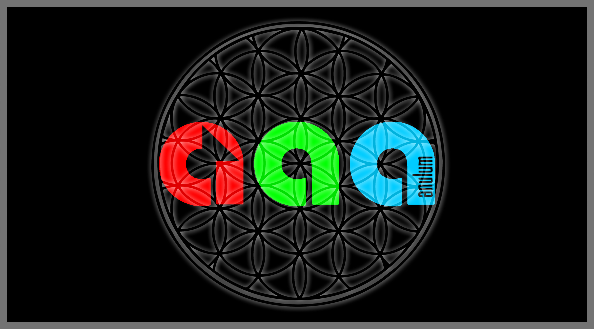

---
hide:
  - navigation
---

# SCPN Phase Orchestrator

<div align="center">

{ width="720" }

[](https://github.com/anulum/scpn-phase-orchestrator/actions/workflows/ci.yml)
[](https://pypi.org/project/scpn-phase-orchestrator/)
[](https://anulum.github.io/scpn-phase-orchestrator/)
[](https://github.com/anulum/scpn-phase-orchestrator/blob/main/LICENSE)
[](https://www.python.org/)

**2100+ Python tests | 173 Rust tests | 95%+ coverage | 32 domainpacks**

</div>

---

Domain-agnostic coherence control compiler built on Kuramoto/UPDE phase dynamics. Any hierarchical coupled-cycle system --- plasma, cloud infrastructure, traffic, power grids, factories, biology --- maps onto the same engine.

## Architecture

```
Domain Binder ─► Oscillators (P/I/S) ─► UPDE Engine (9 variants) ─► Supervisor ─► Actuation
     │                  │                     │                          │             │
binding_spec.yaml   3-channel          Kuramoto, Stuart-Landau,     Policy DSL   ControlAction
                    extraction         Inertial, Market, Swarmalator + Petri Net   + Projector
                    (Physical /        Stochastic, Geometric, Delay  + Regime FSM
                     Informational /   Simplicial + Ott-Antonsen     + MPC
                     Symbolic)         + Rust FFI / JAX GPU
```

## Features

<div class="grid cards" markdown>

-   **32 Domainpacks**

    ---

    Plug-and-play domain bindings: plasma control, power grids, traffic flow, cardiac rhythm, neuroscience EEG, swarm robotics, queuewaves, brain connectome, sleep architecture, and 22 more.

    [:octicons-arrow-right-24: Gallery](galleries/domainpack_gallery.md)

-   **3-Channel Model (P/I/S)**

    ---

    Physical, Informational, and Symbolic oscillator extraction. Each domain signal decomposes into one or more channels with dedicated extractors (Hilbert, wavelet, zero-crossing, event, ring, graph).

    [:octicons-arrow-right-24: Oscillators](concepts/oscillators_PIS.md)

-   **Rust-Accelerated**

    ---

    `spo-kernel` FFI via PyO3/maturin. 7.3 us/step for N=16 oscillators. Pure-Python fallback ships by default.

    [:octicons-arrow-right-24: Rust FFI Guide](guide/rust_ffi.md)

-   **Stuart-Landau**

    ---

    Phase + amplitude coupled ODEs. Subcritical bifurcation detection, PAC (phase-amplitude coupling) metrics, and amplitude-aware supervision.

    [:octicons-arrow-right-24: Stuart-Landau Guide](guide/stuart_landau.md)

-   **Policy DSL**

    ---

    YAML-based declarative supervisor rules. Condition-action pairs triggered by regime state and metric thresholds. Rate-limited, TTL-aware, projector-clipped.

    [:octicons-arrow-right-24: Policy DSL Spec](specs/policy_dsl.md)

-   **Petri Net FSM**

    ---

    Multi-phase protocol sequencing via place/transition nets with guard expressions. Regime-place mapping drives supervisor decisions through protocol stages.

    [:octicons-arrow-right-24: Phase Contract](specs/phase_contract.md)

-   **QueueWaves**

    ---

    Real-time cascade failure detector for microservice architectures. Scrapes queue depths, extracts phases, detects desynchronization before cascading failures propagate.

    [:octicons-arrow-right-24: QueueWaves Guide](guide/queuewaves.md)

-   **Deterministic Replay**

    ---

    SHA256-chained audit trail in JSONL format. Every simulation step is hash-linked and re-executable. Bit-exact verification of entire runs.

    [:octicons-arrow-right-24: Audit Trace Spec](specs/audit_trace.md)

-   **Differentiable (JAX)**

    ---

    `nn/` module: KuramotoLayer, StuartLandauLayer, simplicial 3-body, BOLD, reservoir, UDE, inverse pipeline, OIM. All JIT-compilable, vmap-compatible, GPU-ready.

    [:octicons-arrow-right-24: Differentiable Guide](guide/differentiable_kuramoto.md)

-   **9 ODE Engines**

    ---

    Standard Kuramoto, Stuart-Landau, inertial (power grids), market (finance), swarmalator (robotics), stochastic, geometric, delay, simplicial. Plus Ott-Antonsen mean-field reduction.

    [:octicons-arrow-right-24: Advanced Dynamics](guide/advanced_dynamics.md)

-   **16 Monitors**

    ---

    Chimera detection, EVS entrainment, Lyapunov exponents, entropy production, PAC, PID, transfer entropy, winding numbers, ITPC, sleep staging, STL safety. Beyond R alone.

    [:octicons-arrow-right-24: Analysis Toolkit](guide/analysis_toolkit.md)

-   **Inverse Kuramoto**

    ---

    Infer coupling matrix K and frequencies ω from observed data (EEG, sensors, markets) by backpropagating through the ODE solver. L1 sparsity discovers network topology.

    [:octicons-arrow-right-24: nn/ API](reference/api/nn.md)

</div>

## Quick Install

```bash
pip install scpn-phase-orchestrator
```

```python
from scpn_phase_orchestrator import UPDEEngine
print("OK")
```

[:octicons-arrow-right-24: Installation](getting-started/installation.md){ .md-button }
[:octicons-arrow-right-24: Quickstart](getting-started/quickstart.md){ .md-button .md-button--primary }

## Navigation

| Section | Description |
|---------|-------------|
| [Getting Started](getting-started/installation.md) | Install, quickstart, hello world tutorial |
| [Concepts](concepts/system_overview.md) | System overview, oscillators, control knobs, imprint model |
| [Guides](guide/stuart_landau.md) | Stuart-Landau, QueueWaves, Rust FFI, adapters, production |
| [Specifications](specs/binding_spec.schema.json) | Binding schema, UPDE numerics, policy DSL, all contracts |
| [Tutorials](tutorials/01_new_domain_checklist.md) | New domain checklist, oscillator hunt sheet, Knm templates |
| [API Reference](reference/api/index.md) | Full Python API docs (mkdocstrings) |
| [Gallery](galleries/domainpack_gallery.md) | All 32 domainpacks with descriptions |

---

**Contact:** [protoscience@anulum.li](mailto:protoscience@anulum.li) |
[GitHub Discussions](https://github.com/anulum/scpn-phase-orchestrator/discussions) |
[www.anulum.li](https://www.anulum.li)

<p align="center">
  <a href="https://www.anulum.li">
    
  </a>
  &nbsp;&nbsp;&nbsp;&nbsp;
  <a href="https://www.anulum.li">
    
  </a>
  <br>
  <em>Developed by <a href="https://www.anulum.li">ANULUM</a> / Fortis Studio</em>
  <br><br>
  <strong>License:</strong> AGPL-3.0-or-later | Commercial licensing available
  <br>
  © 1996–2026 Miroslav Šotek. All rights reserved.
</p>
